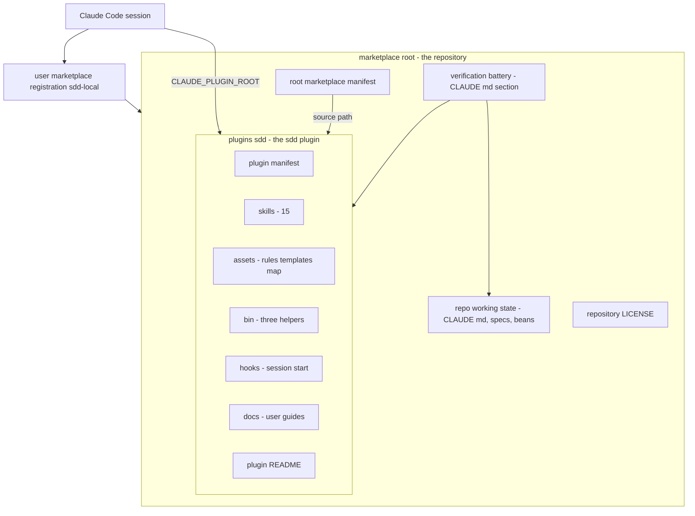
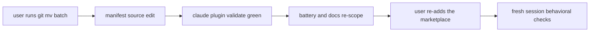

# Design Document — marketplace-restructure

## Overview

**Purpose**: This feature turns the repository from "the repo root IS the sdd
plugin" into a personal Claude Code plugin marketplace: the sdd plugin relocates
verbatim into its own subfolder (`plugins/sdd/`), the root marketplace manifest
references it by path, and the repository's verification battery and
documentation are re-scoped so the same guarantees keep being checked over the
new layout.

**Users**: the repository owner (plugin author and daily user) — nobody else;
the marketplace is local and personal, and publishing is out of scope.

**Impact**: a pure relocation. No plugin file's content changes during the move;
the only content edits are path references outside the moved payload (one
manifest line, two CLAUDE.md sections, a handful of README lines, one e2e-runbook
line). Plugin behavior is identical once the local marketplace registration is
re-pointed.

### Goals

- `plugins/sdd/` is a complete, self-contained plugin unit; future plugins land
  as sibling subfolders without touching it (1.1-1.3).
- `claude plugin validate` passes on the restructured root (2.1-2.3).
- The daily workflow is uninterrupted after the user re-adds the `sdd-local`
  marketplace: `/sdd:*` skills load, the SessionStart hook injects the workflow
  map, `${CLAUDE_PLUGIN_ROOT}` resolves to `plugins/sdd` (3.1-3.6).
- Every move is a user-run `git mv` of unmodified files; history survives (4.1-4.3).
- The verification battery checks the same invariants with the same pinned
  results over the new paths; layout/verification docs reference the new
  locations (5.1-5.3).

### Non-Goals

- Adding any second plugin (separate follow-up features, queued as epics).
- Any change to moved files' contents beyond the enumerated path references in
  documents that stay outside or move with the plugin (see Modified Files).
- Changes to `.zed/` or `.github/workflows/` (no `.github/` exists today).
- Publishing to public marketplaces; renaming the marketplace identity
  (`sdd-local` stays).
- Root cleanliness — plugin-payload files need not be absent from the root
  afterward beyond what the moves themselves produce.
- Bumping `plugin.json` version or editing its fields.

## Boundary Commitments

### This Spec Owns

- The target layout: what lives in `plugins/sdd/`, what stays at the repository
  (marketplace) root.
- The root `.claude-plugin/marketplace.json` `source` edit.
- The ordered, user-executed `git mv` batches (the design pins their content and
  order; tasks hand them over at stop points).
- The registration re-point procedure for `sdd-local` / `sdd@sdd-local`.
- The re-scoped verification battery definition (CLAUDE.md §Verification).
- Path re-referencing in: CLAUDE.md (§Layout, §Verification), the plugin README,
  the e2e runbook.

### Out of Boundary

- Plugin content: skills, assets, bin helpers, hooks, plugin.json move verbatim;
  this spec owns no edits inside them.
- The Claude Code plugin/marketplace platform — consumed as documented, never
  modified.
- Repo-level working state placement: `.sdd/`, `.beans/`, `.superpowers/`,
  `.claude/`, `docs/superpowers/`, `.zed/` stay put.
- Any second plugin's shape beyond the guarantee that it may occupy a new
  subfolder (1.3).

### Allowed Dependencies

- The Claude Code plugin/marketplace platform, exactly as documented on
  2026-09-26: root `.claude-plugin/marketplace.json`; plugin-entry `source` as a
  relative path resolving from the marketplace root (`./plugins/sdd`); the
  plugin's own `.claude-plugin/plugin.json` as the manifest; one marketplace
  registration per name; directory-type marketplace sources resolving relative
  paths in place.
- `git mv` executed by the user (agents are git read-only by global rule).
- Existing battery tooling unchanged: `grep -rIn`, `awk`, `sed`, `diff`,
  `shasum -a 256`, `claude plugin validate`, the beans CLI.

### Revalidation Triggers

- Platform changes to marketplace `source` semantics or validation rules.
- A second plugin being added (manifest append; battery census scope grows).
- Changes to hook/asset path conventions inside the plugin
  (`${CLAUDE_PLUGIN_ROOT}`-relative today).
- Any later move of CLAUDE.md, LICENSE, or `docs/superpowers/` relative to the
  paths re-referenced here.

## Considered Alternatives

### Alternative: Self-contained plugin folder

- **Approach**: everything plugin-facing moves under `plugins/sdd/` — code,
  plugin manifest, `docs/guides/`, and the README; the root keeps the
  marketplace manifest, LICENSE, and repo working state.
- **Strengths**: one folder is one complete, movable plugin; future plugins
  repeat the shape with zero root collisions; the battery scope collapses to a
  single `plugins/sdd/` prefix plus `CLAUDE.md`; matches the platform's
  documented marketplace walkthrough layout.
- **Trade-offs / Risks**: the GitHub repository page loses its root README
  render (immaterial for a personal, local, unpublished marketplace); the moved
  README's repository-level references (LICENSE, `docs/superpowers/`) become
  `../../` links.
- **Verdict**: **Recommended** — self-containment and symmetry beat repo-page
  rendering for a local marketplace.

### Alternative: Code moves, docs stay at root

- **Approach**: `skills/`, `assets/`, `bin/`, `hooks/`, `plugin.json` move;
  README, `docs/guides/`, LICENSE stay at the repository root as
  marketplace-level documentation.
- **Strengths**: the GitHub page keeps rendering the README.
- **Trade-offs / Risks**: the plugin's own documentation lives outside the
  plugin; the README's relative guide links break and become cross-tree links;
  future plugins' docs would collide at the root — precisely the collision
  problem this feature removes.
- **Verdict**: Rejected — splits one knowledge (the sdd plugin and its docs)
  across two homes and re-creates the root-collision problem.

### Alternative: Bare-name sources under metadata.pluginRoot

- **Approach**: the root manifest sets `"metadata": { "pluginRoot": "./plugins" }`
  and entries use bare names (`"source": "sdd"`).
- **Strengths**: shorter entries as the plugin count grows.
- **Trade-offs / Risks**: requires Claude Code v2.1.239+; saves nothing with one
  plugin; adds an indirection layer to every future manifest read.
- **Verdict**: Rejected — revisit only if the marketplace grows and the version
  floor is acceptable.

## Architecture

### Existing Architecture Analysis

Today the repository root is simultaneously the marketplace root and the sdd
plugin root: `.claude-plugin/marketplace.json` sits beside
`.claude-plugin/plugin.json`, and the marketplace entry's `source` is `"./"` —
the plugin resolves to the root itself. That duality is the collision: no second
plugin can be referenced without its files landing at the root too.

All payload-internal cross-references already travel through
`${CLAUDE_PLUGIN_ROOT}` (hooks → `assets/workflow-map.md`, skills →
`assets/rules/*`, `assets/templates/*`, `bin/sdd-*`). The variable resolves to
whichever directory the platform loads as the plugin, so the payload is already
relocation-proof; only the entry point (the manifest `source`) and
repository-level path references change.

### Architecture Pattern & Boundary Map



**Architecture Integration**:
- Selected pattern: the platform's documented multi-plugin marketplace — one
  root manifest, one entry per plugin, each plugin a self-contained subfolder.
  Nothing is invented; the platform model is adopted as-is.
- Domain/feature boundaries: the marketplace root owns plugin discovery (the
  manifest); the plugin folder owns everything the plugin ships; the
  verification battery (a repo working-state artifact in CLAUDE.md) reaches into
  the plugin folder and the working state but owns neither.
- Existing patterns preserved: `${CLAUDE_PLUGIN_ROOT}`-relative internal
  references (unchanged, which is why files move verbatim); the battery's
  pinned-grep shape; beans as the only tracker.
- New components rationale: none — this is a relocation of existing components;
  the only new artifact is the empty `plugins/` directory level.
- Steering compliance: no new dependencies (read-only dependency set);
  simplicity first — one move batch, one manifest line, no new scripts or docs.

### Technology Stack

| Layer | Choice / Version | Role in Feature | Notes |
|-------|------------------|-----------------|-------|
| Platform | Claude Code plugin/marketplace (docs as of 2026-09-26) | Loads the marketplace and plugin; defines `source` resolution and registration semantics | Adopted, not extended; no version-gated features used |
| VCS | git (`git mv`) | Executes every move, preserving history | User-run only; agents read-only |
| Verification | `claude plugin validate`, `grep -rIn`, `awk`/`sed`/`diff`, `shasum -a 256` | Battery and gate checks | All existing; scope strings change only |

No new dependencies at any layer.

## File Structure Plan

### Directory Structure

Post-restructure layout (moved items marked; everything else unchanged):

```
cc-sdd/                              # marketplace root (repo)
├── .claude-plugin/
│   └── marketplace.json             # STAYS; source edited (one line)
├── plugins/                         # NEW directory level
│   └── sdd/                         # the sdd plugin — complete unit
│       ├── .claude-plugin/
│       │   └── plugin.json          # moved verbatim
│       ├── skills/                  # moved verbatim (15 skills)
│       ├── assets/                  # moved verbatim (rules, templates, workflow-map, png)
│       ├── bin/                     # moved verbatim (sdd-gate, sdd-promote, sdd-verdict)
│       ├── hooks/
│       │   └── hooks.json           # moved verbatim
│       ├── docs/
│       │   └── guides/              # moved verbatim (3 guides)
│       └── README.md                # moved; repo-level path refs re-pointed
├── CLAUDE.md                        # STAYS; §Layout + §Verification re-scoped
├── LICENSE                          # STAYS; repository-level license for the whole tree
├── docs/
│   └── superpowers/                 # STAYS (conversion history; excluded from battery)
├── .sdd/  .beans/  .superpowers/    # STAYS (working state)
├── .claude/  .zed/                  # STAYS (repo config / editor state)
└── .beans.yml  .gitignore           # STAYS
```

Untracked working directories (`tmp/`, `.superpowers/` content) stay in place;
only the tracked e2e-runbook file inside `.superpowers/` receives a path edit.

### Modified Files

- `.claude-plugin/marketplace.json` — the single content edit inside the
  manifest: `"source": "./"` becomes `"source": "./plugins/sdd"`. Name
  (`sdd-local`), owner, entry name (`sdd`), and descriptions unchanged (3.1).
- `plugins/sdd/README.md` (after its move) — re-point repository-level
  references: the Getting-started `--plugin-dir` path gains `plugins/sdd`; the
  `docs/superpowers/` mention and the LICENSE link become `../../` references.
  Relative `docs/guides/...` links stay valid because the guides move with the
  README.
- `CLAUDE.md` — §Layout: the tree above replaces the current one, including the
  opening "This repo IS the plugin" claim, which becomes false at the move;
  §Verification: battery scope strings re-scoped (see Verification Battery
  component).
- `.superpowers/sdd/2026-09-22-sdd-plugin-conversion/e2e-runbook.md` —
  `claude --plugin-dir ~/www/cc-sdd` becomes
  `claude --plugin-dir ~/www/cc-sdd/plugins/sdd`. (Untracked file; the edit is
  required by 5.3 but will not appear in the commit.)

No other file's content changes. The moved payload (skills, assets, bin, hooks,
`plugin.json`, guides) is byte-identical before and after (4.1).

## System Flows

Migration order — one broken-registration window, one repair, then continuity
checks:



Flow-level decisions:

- **Move batch is one unit.** Every intermediate state between the first
  `git mv` and the manifest edit is inconsistent (the old `source: "./"` path
  no longer holds `plugin.json`); a single handed batch makes that one interval
  instead of many. Directories are pre-created inside the same handed block
  because `git mv` requires an existing destination directory.
- **Validate is the first green checkpoint**, deliberately after the manifest
  edit: it is the earliest state where manifest and layout agree.
- **The registration window (3.6) spans the whole flow up to ReAdd.** A session
  started before ReAdd simply has no sdd plugin available; nothing to fix — the
  user re-adds, then starts or reloads a session.
- **Battery and docs re-scope before ReAdd** so the repository is fully
  consistent at the moment the user repairs their registration.

## Requirements Traceability

| Requirement | Summary | Components | Interfaces | Flows |
|-------------|---------|------------|------------|-------|
| 1 | Plugin placement: one subfolder per plugin under `plugins/`; sdd at `plugins/sdd/`; future plugins need no changes inside existing subfolders | sdd plugin folder; target layout (File Structure Plan) | Marketplace manifest contract (append-only entries) | — |
| 2 | Marketplace manifest validity: plugin referenced by path; plugin manifest inside its subfolder; `claude plugin validate` passes | Root marketplace manifest; sdd plugin folder | Marketplace manifest contract (JSON) | Migration flow (Validate checkpoint) |
| 3 | Installation continuity: `sdd-local` / `sdd@sdd-local` preserved; re-add replaces in place; skills load, hook injects, `CLAUDE_PLUGIN_ROOT` resolves to `plugins/sdd`; pre-re-add session has no plugin | Registration re-point procedure; sdd plugin folder (verbatim payload) | Registration procedure contract (CLI sequence) | Migration flow (ReAdd, FreshCheck; window annotation) |
| 4 | Move integrity: unmodified contents; user-run `git mv`; history preserved | Migration execution model | Move-batch contract (command block) | Migration flow (Move) |
| 5 | Battery and docs alignment: same invariants, pinned results (zero / exactly 6), docs reference new locations | Verification battery; Documentation re-referencing | Battery scope contract; documentation edit list | Migration flow (Rescope) |

## Components and Interfaces

| Component | Domain/Layer | Intent | Req Coverage | Key Dependencies | Contracts |
|-----------|--------------|--------|--------------|------------------|-----------|
| Root marketplace manifest | Marketplace root | Plugin registry: one entry per plugin by relative path | 1, 2 | Platform validation (P0) | File content |
| sdd plugin folder | Plugin unit | The complete relocatable plugin | 1, 2, 3, 4 | Platform loading (P0) | — (verbatim payload) |
| Migration execution model | Process | Handed `git mv` batches, ordered and user-run | 4 | git (P0), user execution (P0) | Command block |
| Registration re-point procedure | External integration | Restore the user's `sdd-local` registration against the new layout | 3 | Platform CLI (P0) | CLI sequence |
| Verification battery | Repo working state | Same invariants, same pinned results, new scope | 5 | Existing tooling (P1) | Scope contract |
| Documentation re-referencing | Repo working state | Layout/verification docs name post-move paths | 5 | — | Edit list |

### Marketplace Root

#### Root marketplace manifest

| Field | Detail |
|-------|--------|
| Intent | Sole registry of plugins the marketplace offers |
| Requirements | 1, 2.1, 2.3 |
| Home | `.claude-plugin/marketplace.json` |

**Responsibilities & Constraints**
- Owns plugin discovery and nothing else; plugin behavior lives entirely inside
  `plugins/sdd/`.
- Entry list is append-only for future plugins: a new plugin is a new
  `plugins/<name>/` subfolder plus one new entry (1.3); existing subfolders and
  the existing entry never change to admit it.

**Dependencies**
- External: Claude Code platform validation — `claude plugin validate <root>`
  reads this file and each referenced plugin (P0).

**Contracts**: File content.

##### Manifest content after the edit
```json
{
  "name": "sdd-local",
  "description": "Local marketplace for the sdd plugin",
  "owner": { "name": "Vasyl Sokolyk" },
  "plugins": [
    {
      "name": "sdd",
      "source": "./plugins/sdd",
      "description": "Kiro-style spec-driven development for Claude Code with subagent-first execution"
    }
  ]
}
```
- Preconditions: `plugins/sdd/.claude-plugin/plugin.json` exists (the move batch
  has run).
- Postconditions: `claude plugin validate` at the repository root passes with no
  errors (2.3); the entry name `sdd` matches the plugin manifest name `sdd`.
- Invariants: everything except the `source` value is byte-identical to the
  current manifest.

### Plugin Unit

#### sdd plugin folder

| Field | Detail |
|-------|--------|
| Intent | The complete, self-contained sdd plugin at `plugins/sdd/` |
| Requirements | 1.1, 1.2, 2.2, 3.3, 3.4, 3.5, 4.1, 4.3 |
| Home | `plugins/sdd/` (see File Structure Plan) |

**Responsibilities & Constraints**
- Contains everything the plugin ships: `.claude-plugin/plugin.json` (2.2),
  `skills/`, `assets/`, `bin/`, `hooks/`, `docs/guides/`, `README.md`.
- Payload is byte-identical to the pre-move root payload (4.1); the platform
  resolves `${CLAUDE_PLUGIN_ROOT}` to this folder, which keeps every internal
  reference working unchanged (3.3-3.5).
- No new boundaries introduced — this is a relocation; summary-only by design.

**Implementation Notes**
- Integration: the SessionStart hook cats
  `${CLAUDE_PLUGIN_ROOT}/assets/workflow-map.md`; a successful injection in a
  fresh session is the behavioral proof that the variable resolves to
  `plugins/sdd` (3.4, 3.5).
- Validation: 15-skill census at `plugins/sdd/skills/` (battery member).
- Risks: none identified — references were verified `${CLAUDE_PLUGIN_ROOT}`
  -relative during discovery.

### Process

#### Migration execution model

| Field | Detail |
|-------|--------|
| Intent | User-run `git mv` batches that produce the target layout without content changes |
| Requirements | 4.1, 4.2, 4.3 |
| Home | Handed at implementation stop points; produces the File Structure Plan tree |

**Responsibilities & Constraints**
- The agent issues commands; the user executes them (4.2). No git write is ever
  agent-run.
- One batch, this exact shape (directory pre-creation included, because
  `git mv` needs an existing destination):

```bash
mkdir -p plugins/sdd/.claude-plugin plugins/sdd/docs
git mv skills assets bin hooks README.md plugins/sdd/
git mv docs/guides plugins/sdd/docs/guides
git mv .claude-plugin/plugin.json plugins/sdd/.claude-plugin/plugin.json
```

**Dependencies**
- External: git — `git mv` preserves rename history (P0).

**Contracts**: Command block (above).
- Preconditions: clean working tree (the user commits or stashes first; the
  batch must be the only pending change).
- Postconditions: `git status` shows pure renames; `git log --follow` on a moved
  file (e.g. `plugins/sdd/.claude-plugin/plugin.json`) reaches pre-move history
  (4.3).
- Invariants: zero content modifications inside the moved set (4.1).

**Implementation Notes**
- Integration: the manifest edit (a normal file edit, agent-allowed) follows the
  user's move batch; validate follows the edit.
- Validation: `git status` shows renames only; `git diff --staged -M` empty on
  content.
- Risks: `git mv docs/guides plugins/sdd/docs/guides` leaves `docs/` holding
  only `superpowers/` — expected, not a cleanup target.

#### Registration re-point procedure

| Field | Detail |
|-------|--------|
| Intent | Restore the user's local marketplace registration against the restructured repository |
| Requirements | 3.1, 3.2, 3.6 |
| Home | User-run CLI sequence; handed at the migration's ReAdd step |

**Responsibilities & Constraints**
- Preserves the marketplace name `sdd-local` and the plugin reference
  `sdd@sdd-local` — nothing is renamed anywhere (3.1).
- User-run (it mutates the user's Claude Code configuration, outside both the
  repo and the agent's write scope).

**Dependencies**
- External: `claude plugin marketplace add` — one registration per name; re-add
  under the existing name replaces the registration in place (P0).

**Contracts**: CLI sequence.
- Primary: `claude plugin marketplace add /Users/vasilsokolik/www/cc-sdd`
- Fallback (if the CLI refuses a same-name re-add):
  `claude plugin marketplace remove sdd-local` then the add above.
- Preconditions: the repository is at the Validate-green checkpoint (manifest
  and layout agree).
- Postconditions: `claude plugin marketplace list` shows `sdd-local` → Directory
  (`/Users/vasilsokolik/www/cc-sdd`); the existing
  `enabledPlugins["sdd@sdd-local"]` setting keeps applying; a fresh session loads
  `/sdd:*` skills and injects the workflow map.
- Invariants: exactly one `sdd-local` registration afterward — no duplicate
  entry (3.2).

**Implementation Notes**
- Integration: `/reload-plugins` inside a running session, or a fresh session,
  picks up the re-pointed registration.
- Validation: fresh-session checks in Testing Strategy.
- Risks: replace-in-place is documented and pinned by 3.2 but not
  machine-verified pre-move — the fallback covers a refusal; verify at
  execution.

### Repo Working State

#### Verification battery (re-scoped)

| Field | Detail |
|-------|--------|
| Intent | Same invariants, same pinned results, checked over the new layout |
| Requirements | 5.1, 5.2 |
| Home | CLAUDE.md §Verification (living definition); pattern texts pinned in `docs/superpowers/` spec docs (historical) |

**Responsibilities & Constraints**
- Checks, never owns: the battery reads the plugin folder and the working state
  and writes nothing.
- Every member survives the move with its pinned result intact because all
  checked content moves verbatim; only scope strings change.

**Dependencies**
- Outbound: plugin folder (zero-hit and twin greps, census) (P1);
  CLAUDE.md itself (in scope today, stays in scope) (P1).

**Contracts**: Scope contract — the battery scope list in CLAUDE.md §Verification
becomes:

- Zero-hit greps: `plugins/sdd/skills/ plugins/sdd/assets/ plugins/sdd/hooks/
  plugins/sdd/README.md CLAUDE.md plugins/sdd/docs/guides/`
- Convention set additionally: `plugins/sdd/bin/`
- Exactly-6 twin count-greps: `plugins/sdd/skills/` (6 stays 6 — files move
  verbatim)
- Approve-gate paired-diff: over `plugins/sdd/skills/spec-requirements/SKILL.md`
  and `plugins/sdd/skills/spec-design/SKILL.md`, method unchanged
- 15-skill census: `plugins/sdd/skills/`
- `claude plugin validate .` at the repository root (unchanged)
- e2e dry run per the re-pointed runbook

CLAUDE.md §Verification additionally notes the mapping: pattern texts as pinned
in the historical spec docs apply with the `plugins/sdd/` prefix. The historical
docs are append-only records and are not edited (5.1 checks the same invariants;
it does not rewrite history).

**Implementation Notes**
- Integration: re-scope lands as the CLAUDE.md edit inside the Rescope step,
  before the user re-adds the marketplace.
- Validation: one full battery run over the restructured tree at the Rescope
  step — zero hits where zero is pinned, exactly 6 where 6 is pinned (5.2).
- Risks: scope-string drift between CLAUDE.md and the historical docs —
  mitigated by the explicit prefix-mapping note.

#### Documentation re-referencing

| Field | Detail |
|-------|--------|
| Intent | Layout/verification documentation names post-restructure locations |
| Requirements | 5.3 |
| Home | `CLAUDE.md`, `plugins/sdd/README.md`, `.superpowers/.../e2e-runbook.md` |

**Responsibilities & Constraints**
- The complete edit list is the Modified Files section; nothing outside it is
  re-referenced.
- CLAUDE.md §Layout replaces the tree and the "This repo IS the plugin" opening
  claim (false after the move); §Verification takes the scope contract above.
- The README keeps its meaning with new paths: `--plugin-dir` gains
  `plugins/sdd`; `docs/superpowers/` and LICENSE become `../../` references.
- The e2e runbook's `--plugin-dir` line points at the plugin folder.

**Implementation Notes**
- Validation: every changed line names an existing post-move path; README links
  resolve from `plugins/sdd/`.
- Risks: the e2e runbook is untracked — its edit is real but unversioned;
  noted so no one expects it in the commit.

## Error Handling

### Error Strategy

The migration has one expected broken state and three repairable failure
classes:

- **Registration window (expected, 3.6)**: between the move batch and the
  re-add, `sdd@sdd-local` cannot load — the old `source: "./"` path no longer
  holds the plugin. Response: proceed through Rescope and ReAdd; sessions
  started inside the window simply run without the plugin. No data is lost; the
  `enabledPlugins` setting persists.
- **Validate red after the manifest edit**: the validate output names the field
  (e.g. `plugins[0].source`). Causes limited to a mistyped `source` or a missed
  move; fix the named field, re-validate. Validate is the gate before anything
  downstream.
- **Re-add refusal**: if `claude plugin marketplace add` errors on the existing
  name, run the documented fallback (remove, then add). The plugin reference
  `sdd@sdd-local` is untouched by both paths.
- **Move failure**: `git mv` fails when the destination directory is missing —
  the handed batch pre-creates directories (`mkdir -p`) ahead of the moves, and
  a failed batch leaves pure-renames-or-nothing in `git status` for the user to
  inspect.

### Monitoring

None — a one-shot local migration with explicit checkpoints (validate, battery
run, fresh-session checks) instead of monitoring.

## Testing Strategy

### Validation (2.3)

- `claude plugin validate .` at the restructured root: zero errors, immediately
  after the manifest edit (the migration's first green checkpoint).
- `claude plugin validate` output names the marketplace manifest at the root and
  the plugin entry by path — confirms the entry resolves to `plugins/sdd`.

### Battery (5.1, 5.2)

- Full battery run over the restructured tree: every zero-hit grep returns zero;
  each of the three twin count-greps returns exactly 6 (one hit per fork file);
  the approve-gate paired-diff is empty; the census finds 15 skills under
  `plugins/sdd/skills/`.

### Behavioral — fresh session after re-add (3.2-3.5)

- `claude plugin marketplace list` shows exactly one `sdd-local` entry pointing
  at the repository directory (no duplicate).
- Session start in a scratch project: the workflow map is injected (proves both
  hook execution and `${CLAUDE_PLUGIN_ROOT}` → `plugins/sdd` resolution, since
  the hook cats `${CLAUDE_PLUGIN_ROOT}/assets/workflow-map.md`).
- `/sdd:` skills appear invocable in the session.

### Move integrity (4.1, 4.3)

- `git status` after the batch: pure renames, no modifications.
- `git log --follow plugins/sdd/.claude-plugin/plugin.json` (and at least one
  skill file) reaches commits predating the move.

## Supporting References

- Discovery detail, platform quotes, and decision rationale: `research.md` in
  this spec directory.
- Interview intent and prior platform research: `workspace/qa-digest.md`.
- Battery pattern texts (historical, pre-move scope):
  `docs/superpowers/specs/2026-09-22-sdd-plugin-conversion-design.md` §10 and
  `docs/superpowers/specs/2026-09-25-content-normalization-design.md` §4.
